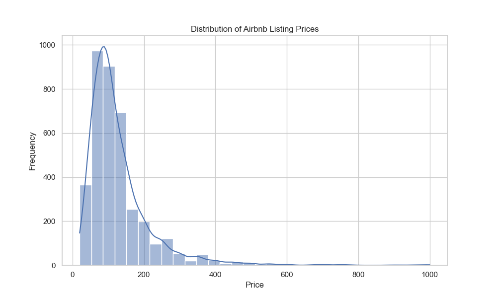
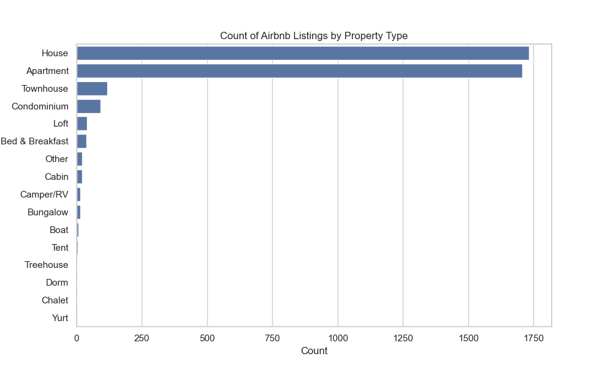

# Airbnb EDA Project Report

## Introduction
This report provides insights derived from the analysis of the Airbnb dataset, focusing on the listings, calendar, and reviews data. The primary goal is to understand pricing patterns, property types, and trends over time.

## Data Overview
- **Listings Dataset:** Contains information about Airbnb properties, including prices, property types, and neighborhood details.
- **Calendar Dataset:** Provides daily availability and pricing of the listings.
- **Reviews Dataset:** Contains customer reviews and ratings associated with each listing.

## Key Insights

### 1. Distribution of Airbnb Listing Prices

- The distribution of prices shows a right-skewed pattern, indicating that most listings are priced lower, with a few high-priced outliers. This suggests a diverse range of affordability among listings.

### 2. Count of Different Property Types

- The most common property types are "Entire home/apt" and "Private room," indicating a preference among users for larger accommodations. This insight can guide property owners on market demand.

### 3. Average Price by Neighborhood

- The average prices vary significantly across neighborhoods, with certain areas commanding much higher rates. This indicates the importance of location in pricing strategy.

### 4. Count of Listings Over Time

- The analysis of listings over time shows fluctuations in the number of available listings. This trend may correlate with seasonal demand patterns in the Airbnb market.

### 5. Average Price Over Time

- The average price over time displays an upward trend, suggesting an increase in demand or changing market conditions, which could be influenced by factors such as local events or economic shifts.

### 6. Correlation Analysis

- The correlation matrix indicates significant relationships between several features:
  - **Price and Number of Reviews:** A positive correlation suggests that listings with more reviews tend to have higher prices, possibly indicating better quality or more desirable properties.
  - **Price and Review Scores:** Higher review scores are associated with higher prices, reinforcing the notion that well-reviewed properties can command premium pricing.

## Conclusion
This exploratory data analysis of the Airbnb dataset has provided valuable insights into pricing dynamics, property preferences, and market trends. The findings can aid hosts in optimizing their listings and help potential investors identify lucrative opportunities within the Airbnb market.

## Recommendations
- **For Hosts:** Consider adjusting prices based on neighborhood trends and competition to maximize occupancy rates.
- **For Investors:** Focus on high-demand neighborhoods with potential for higher returns based on average price trends and listing availability.

